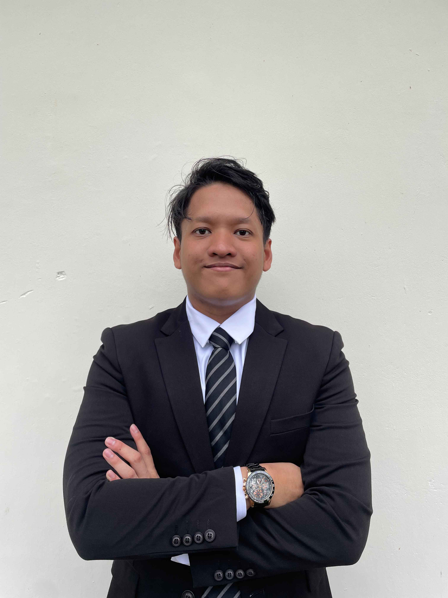

## Hi there 👋

 <!-- Replace with your actual image link -->

## Headline
Computer Science Student

## Summary
### >I am a computer science student currently pursuing Computer and Network Security at University Technology Malaysia 
### > Currently I am under scholarship called Khazanah WATAN
### > My ambition is that I want to be a freelancer that will take a project from other companies to strengthen their network

## Core

### Education
**Foundation in Physical Science**, University Technology MAlaysia, 2022

### Position

## Skills
**Programming Languanges:** C++
**Cloud Computing:** Microsoft Azure Fundamentals

## Recommended

### Courses
**Web Programming:** University Technology Malaysia
**Object-Oriented Programming:** University Technology Malaysia

### Certificates

---

## Additional

## Honors and Awards
**Dean's Award:** Semester 1, 3

### Projects

## Contact
**Personal Email:** taimanaliff@gmail.com
**Organization Email:** tengku03@graduate.utm.my
**Linkedin:** [Tengku Aiman LinkedIn](www.linkedin.com/in/tengku-muhammad-aiman-aliff-257065254)
**Twitter:** 

## Assignments

### Assignment 1: Report

**PDF File:** Video Games Website Analysis Using Google Lighthouse.pdf

#### Reflection

### Assignment 2: Website
**Website:** https://github.com/Tmanlip/tmanlip.github.io.git

#### Reflection

### Assignment 3: Github E-Portfolio

#### Reflection

## Projects

<!--
**Tmanlip/Tmanlip** is a ✨ _special_ ✨ repository because its `README.md` (this file) appears on your GitHub profile.

Here are some ideas to get you started:

- 🔭 I’m currently working on ...
- 🌱 I’m currently learning ...
- 👯 I’m looking to collaborate on ...
- 🤔 I’m looking for help with ...
- 💬 Ask me about ...
- 📫 How to reach me: ...
- 😄 Pronouns: ...
- ⚡ Fun fact: ...
-->
